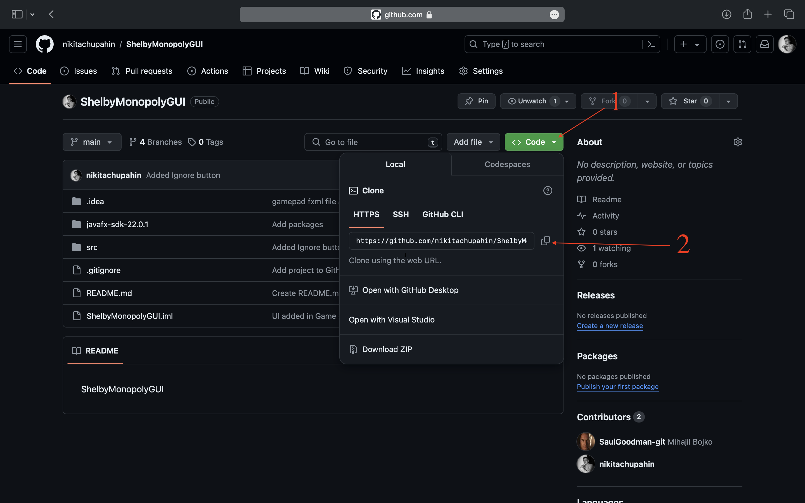

# Welcome to ShelbyMonopoly 
## Сreated by ShelbyTeam in the Java

You can start by cloning the repository to your computer using the following command:
```
git clone <url>
```
You can copy the Url here



This is what our graphical user interface looks like

